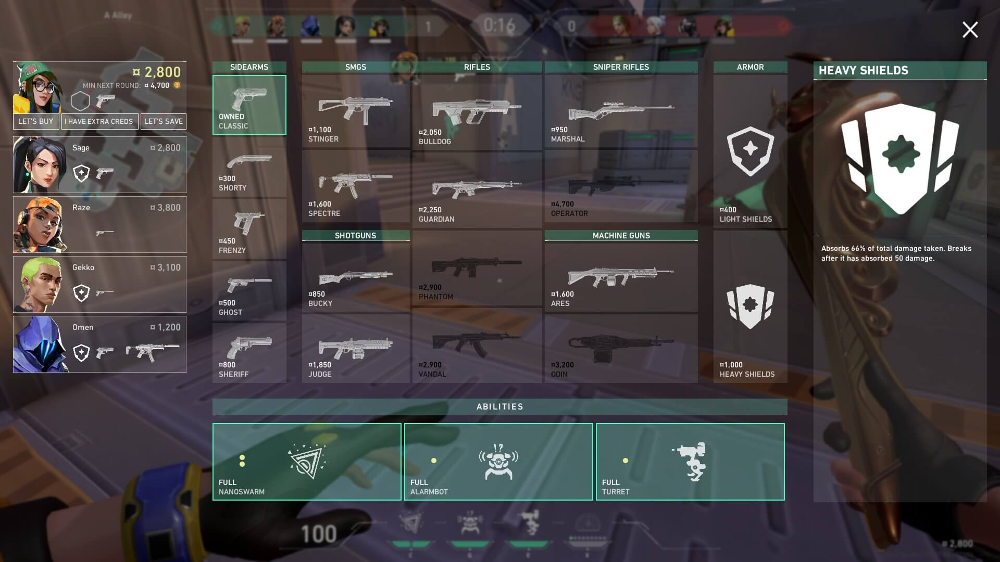

# Consejo Pro: Gestión Económica en Valorant

La gestión del dinero (economía) es uno de los aspectos más importantes en Valorant que muchos jugadores novatos descuidan. Entender cuándo hacer buy full, cuando hacer half-buy y cuándo hacer eco puede determinar el resultado de toda una serie de rondas.

## Sistema Económico Básico

En cada ronda ganas dinero por eliminar enemigos, plantar la Spike o ganar la ronda. Tu presupuesto debe ser cuidadosamente planeado para garantizar que tu equipo pueda ejecutar estrategias ganadoras.

## Patrones de Compra

Los equipos profesionales siguen patrones específicos: si pierden la ronda inicial de compra (pistol), hacen eco (fuerzan compra baja) para evitar que el enemigo se equipe perfectamente. Luego, si ganan esa ronda de eco, hacen un "full buy" donde todos compran armas de nivel medio o alto.

## Victoria a Través de la Economía

Algunos equipos han ganado series enteras simplemente siendo más inteligentes con la economía. Incluso con menos skill puro, una buena gestión económica y coordinación pueden superar a equipos con jugadores individuales más hábiles.

