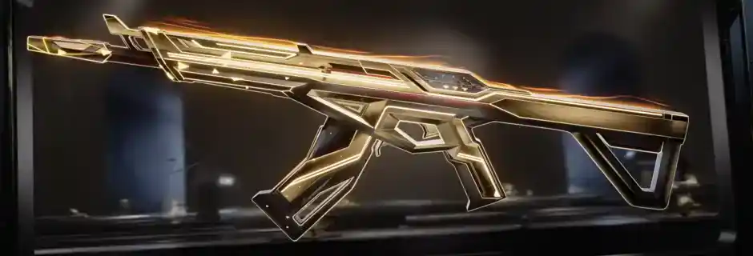

# Valorant Championship Series: El Mayor Torneo del Año

El Valorant Championship Series (VCS) 2025 está en marcha, trayendo consigo la competición más intensa del año. Los mejores equipos de Valorant a nivel mundial se enfrentan para demostrar su dominio en el juego.

## Equipos Participantes

Los equipos top mundiales como Sentinels, FaZe Clan, Fnatic y LOUD compiten ferozmente por el título y el premio de millones de dólares. Cada partido es una batalla táctica donde los agentes, economía de dinero y rotaciones son críticos.

## Momentos Memorables

Hasta el momento, hemos visto jugadas espectaculares con clutches de 1 vs 5, utilización perfecta del ult de Jett y round wins imposibles. Los equipos están mostrando estrategias innovadoras que están redefiniendo cómo se juega Valorant profesionalmente.

