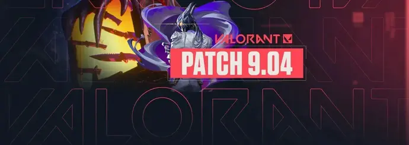

# Valorant Patch 9.14: Cambios Importantes en los Agentes

Riot Games ha lanzado la nueva actualización de Valorant con ajustes significativos para mejorar el equilibrio competitivo. Los principales cambios incluyen nerfs para Jett y buffs para Sova, quien ahora puede recolectar información de forma más efectiva.

Los jugadores profesionales están analizando cómo estos cambios afectarán el meta actual. Jett, que ha sido un agente dominante en los últimos meses, verá reducida la velocidad de recarga de su habilidad de dash. Por otro lado, Sova recibirá mejoras en su dron reconocedor, permitiendo que durabilidad y alcance sean mayores.

Estos ajustes buscan crear un entorno de juego más diverso donde diferentes composiciones de agentes sean viables competitivamente.

