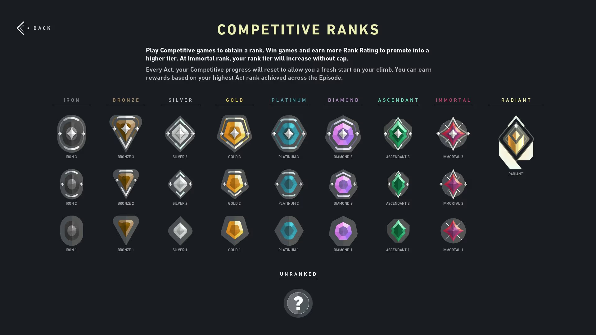

# Guía Completa: Cómo Mejorar tu Rank en Valorant

En este artículo compartimos los mejores recursos y consejos para que subas de rango en Valorant. Mejorar en el juego requiere dedicación, práctica y comprensión de las mecánicas fundamentales.

## Entrenamiento de Mecánicas

Antes de entrar a partidas competitivas, dedica tiempo al modo de entrenamiento. Practica tu apuntería, velocidad de reacción y control del recoil. Muchos profesionales dedican 30 minutos diarios a mejorar sus habilidades básicas.

## Comprensión del Mapa

Estudiar los mapas es crucial. Aprende las posiciones comunes de defensa, ataques frecuentes y rotaciones inteligentes. Cada mapa tiene su propia estrategia que los equipos competitivos utilizan.

## Comunicación con el Equipo

Sin importar tu skill individual, la comunicación clara con tu equipo es fundamental. Callouts rápidos, información de enemigos y coordinación de rotaciones pueden ser la diferencia entre ganar y perder rondas.

## Revisar Replays

Ve tus propias partidas y analiza tus errores. Identifica dónde mueres, por qué mueres y cómo podrías haberlo evitado. Este análisis crítico es lo que separa a los jugadores que crecen rápidamente de los que se quedan estancados.

