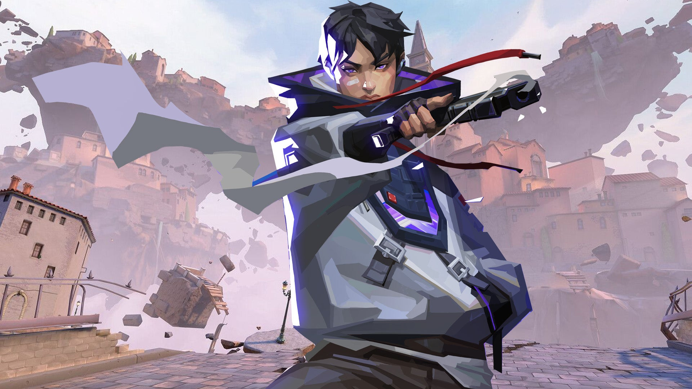

# Nuevo Agente Valorant: ISO - El Duelist Técnico

Riot Games ha presentado a **ISO**, el nuevo Duelist de Valorant, y promete revolucionar la forma en que los jugadores comprenden el combate 1 vs 1. ISO es un agente diseñado para dominar duelos individuales con mecánicas únicas nunca antes vistas.

## Habilidades de ISO

**Signature (Q)**: Crea un muro que solo ISO puede ver a través, permitiéndole una ventaja táctica en enfrentamientos directos.

**Redondel (E)**: Proyecta un pulso que marca enemigos dentro de un área específica.

**Cast (C)**: Genera un campo de protección que lo hace más resistente temporalmente.

**Ultimate (X)**: Activa una forma mejorada que amplifica todas sus habilidades.

## Impacto en el Meta

ISO cambia significativamente el rol de Duelist. A diferencia de Jett o Raze que priorizan el movimiento y el daño de área, ISO se enfoca en el control del espacio y ganar duelos frontales. Los analistas predicen que veremos nuevas composiciones de equipo que aprovechan sus habilidades defensivas.

